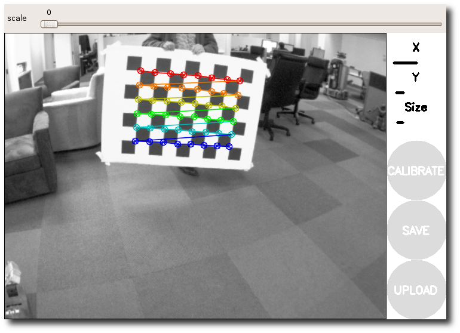
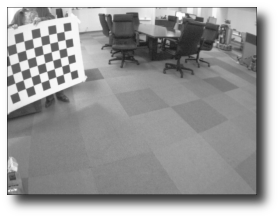
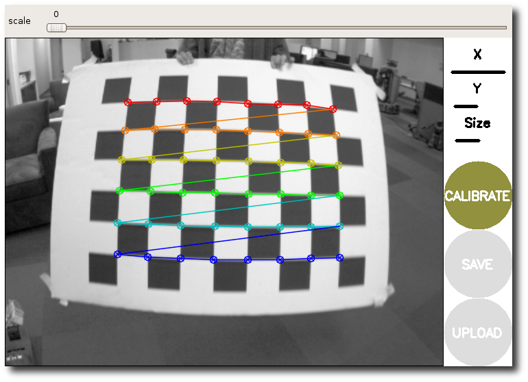
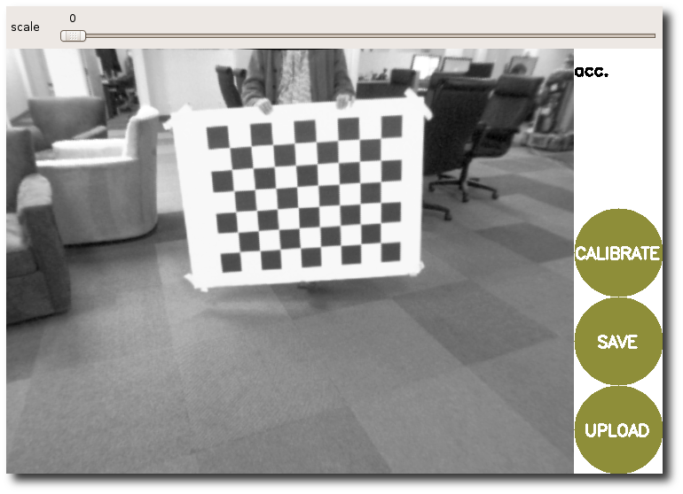

# Calibrating a USB Camera (Logitech C920 HD Pro Camera) with ROS Noetic on Ubuntu 20.04 

ROS uses OpenCV for camera calibration but the format in which it stores the data differs from OpenCV. Also, you need to know where to place the camera calibration files so ROS can find and publish them (/home/<username>/.ros/camera_info/head_camera.yaml).

First, you can connect the Logitech C920 HD Pro camera to your laptop.

1. Open the first terminal and run the ROS master:

```bash
roscore
```

Please keep this terminal open.

2. Open the second terminal, install the USB cam package from ROS and uvcdynctrl to disable autofocus, open a terminal, and run the below:

```bash
sudo apt-get install ros-noetic-usb-cam uvcdynctrl
```

3. Now, check if your camera autofocus status:

```bash
uvcdynctrl --device=/dev/video2 --clist

Listing available controls for device /dev/video2:
  Brightness
  Contrast
  Saturation
  White Balance Temperature, Auto
  Gain
  Power Line Frequency
  White Balance Temperature
  Sharpness
  Backlight Compensation
  Exposure, Auto
  Exposure (Absolute)
  Exposure, Auto Priority
  Pan (Absolute)
  Tilt (Absolute)
  Focus (absolute)
  Focus, Auto
  Zoom, Absolute
```

4. If it is enabled, you can turn off the autofocus:

```bash
uvcdynctrl --device=/dev/video2 --set='Focus, Auto' 0
```

check if the autofocus is off or not:

```bash
uvcdynctrl --device=/dev/video2 --get='Focus, Auto'
```

5. Now, install camera calibration:

```bash
rosdep install camera_calibration
```

6. Publish the data from your camera, for example, via using usb_cam:

```bash
rosrun usb_cam usb_cam_node
```

7. In the third terminal, run rostopic list:

```bash
rostopic list

/rosout
/rosout_agg
/usb_cam/camera_info
/usb_cam/image_raw
/usb_cam/image_raw/compressed
/usb_cam/image_raw/compressed/parameter_descriptions
/usb_cam/image_raw/compressed/parameter_updates
/usb_cam/image_raw/compressedDepth
/usb_cam/image_raw/compressedDepth/parameter_descriptions
/usb_cam/image_raw/compressedDepth/parameter_updates
/usb_cam/image_raw/theora
/usb_cam/image_raw/theora/parameter_descriptions
/usb_cam/image_raw/theora/parameter_updates
```

8. Open the fourth terminal, and connect camera_calibration to the node publishing camera images:
   (node and topic name should be adjusted: image:=/usb_cam/image_raw
                                            camera:=/usb_cam) and a checkerboard with
                                            0.02517-meter squares:

```bash
rosrun camera_calibration cameracalibrator.py --size 9x6 --square 0.02517 image:=/usb_cam/image_raw camera:=/usb_cam --no-service-check
```
This will open up the calibration window, which will highlight the checkerboard:



Note:
If you can't see any colored dots, make sure you count the interior vertex points, not the squares!

In order to get a good calibration you will need to move the checkerboard around in the camera frame.

At each step, hold the checkerboard still until the image is highlighted in the calibration window.



As you move the checkerboard around, you will see three bars on the calibration sidebar increase in length, when the CALIBRATE button is lit up or enabled.



9. After getting enough images, click on the calibrate and then save.


  
12. If you click on the commit button, it will copy calibration data into:

/home/[username]/.ros/camera_info/head_camera.yaml
 
10. Find the calibration file path. Keep the YAML file in that path:

/home/[username]/.ros/camera_info/head_camera.yaml

Note: Try to keep the checkerboard slightly oriented (45/90/135/180 degrees) and change it from clockwise to anti-clockwise during the calibration process. 

**References:**

[1]. https://wiki.ros.org/camera_calibration/Tutorials/MonocularCalibration/

[2]. https://ros-developer.com/2017/04/23/camera-calibration-with-ros/
